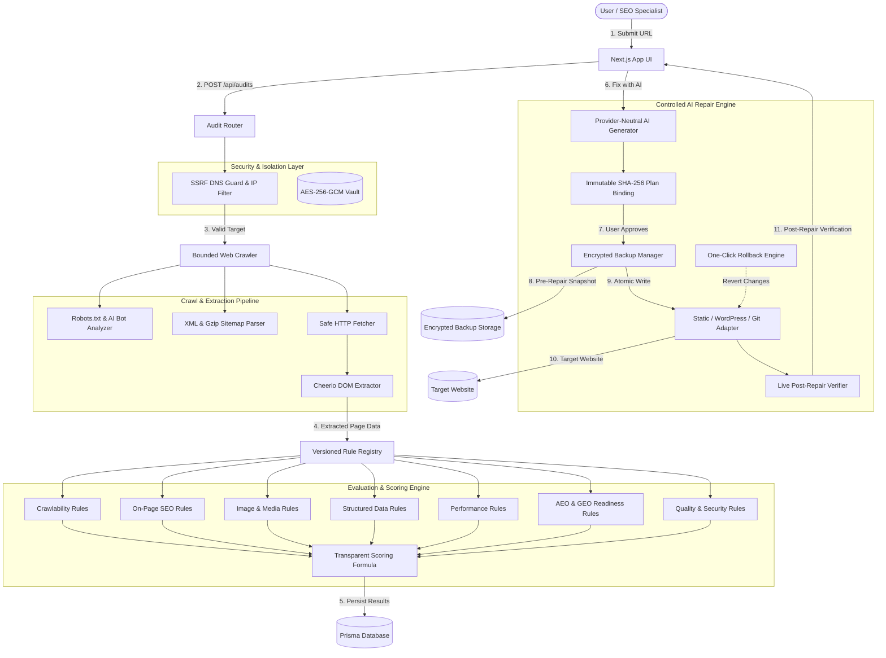

# SiteDoctor AI - Architecture & Data Flow

## 1. System Overview
SiteDoctor AI is designed as a modular SaaS platform with strict process and credential isolation:
- **Next.js 15 App Router Frontend**: High-performance dashboard, audit wizards, real-time status visualizers, interactive issue explorer, reviewable code diff viewer, and rollback manager.
- **API Core & Security Guard**: Route handlers enforcing tenant isolation, cryptographic plan hash bindings, and SSRF prevention.
- **SSRF-Shielded Crawler**: Validates hostnames via DNS, strictly blocking private networks, link-local, loopback, and cloud metadata destinations. Follows robots.txt directives, discovers XML sitemaps (including gzip compressed indexes), and normalizes URLs.
- **Versioned Rule Registry & Scoring Engine**: Evaluates 40+ deterministic rules across 6 core technical categories (Crawlability, On-Page SEO, Images, Structured Data, Performance, Quality) and 1 advisory category (AEO & GEO readiness).
- **Provider-Neutral AI Engine**: Generates schema-validated repair proposals without receiving raw credentials, shielded from web prompt injection attacks.
- **Repair Engine & Adapters**: Constrained adapters for Static HTML, WordPress REST API, and Git branches with pre-flight content hash checks, encrypted atomic backups, atomic file replacement, live verification, and scoped rollback.

## 2. Architecture & Data Flow Diagram

## 3. Key Guarantees
1. **SSRF Hardening**: DNS resolution is performed pre-fetch. Resolving to `127.0.0.1`, `10.0.0.0/8`, `172.16.0.0/12`, `192.168.0.0/16`, `169.254.169.254`, or IPv6 equivalents immediately aborts the request.
2. **Zero Credential Exposure**: Connection secrets are encrypted with AES-256-GCM. AI prompts only receive isolated snippets and audit evidence.
3. **Atomic File Writes**: Writes are completed to a temporary file on the target filesystem and atomically renamed, avoiding partially written files.
4. **Pre-Flight Conflict Checks**: Target resource SHA-256 is checked against the proposal baseline. External edits result in a Conflict exception rather than a silent overwrite.
